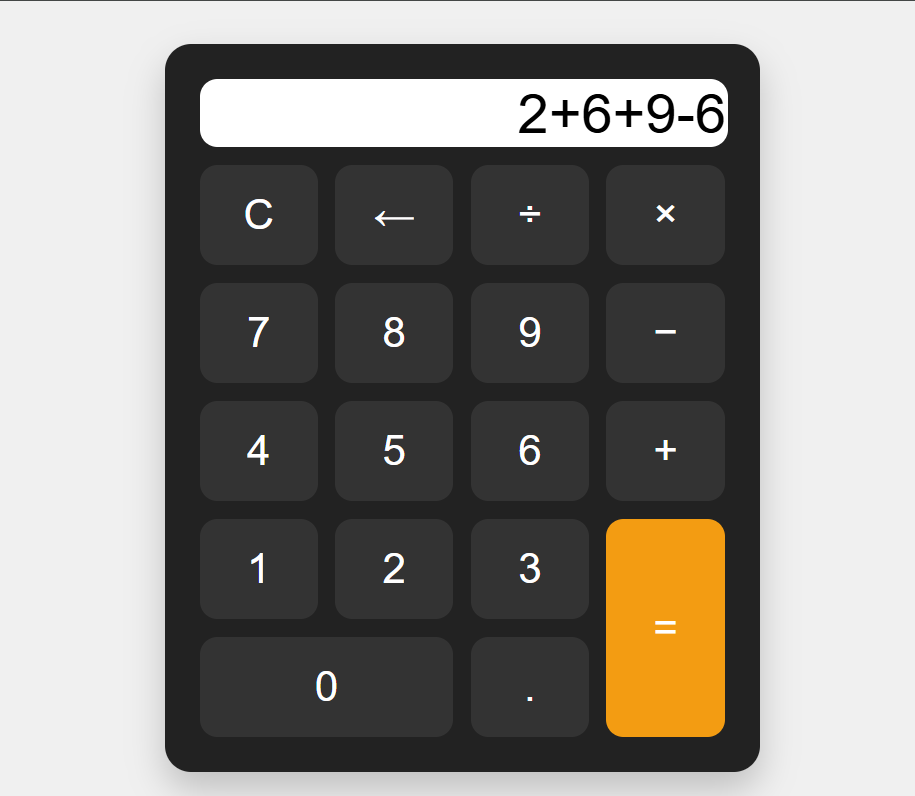

# 🧮 Calculadora Web com Python (Flask)

Este projeto é uma calculadora com visual semelhante a uma calculadora física tradicional, desenvolvida com **Python (Flask)** no backend e **HTML, CSS e JavaScript** no frontend. A aplicação roda localmente via servidor Flask e permite realizar operações aritméticas básicas.

---

## 📸 Preview

 <!-- Adicione uma imagem real se desejar -->

---

## 🚀 Funcionalidades

- Interface gráfica responsiva
- Operações básicas: `+`, `-`, `×`, `÷`, `.`, `C`, `←`
- Cálculo em tempo real
- Exibição de mensagens de erro
- Design semelhante a uma calculadora física

---

## 📁 Estrutura do Projeto

calculadora/
├── app.py # Arquivo principal do Flask
├── static/
│ ├── style.css # Estilos da interface
│ └── script.js # Lógica da calculadora em JavaScript
├── templates/
│ └── index.html # Interface HTML
└── README.md

---

## ⚙️ Como Executar Localmente

1. Clone o repositório:

```bash
git clone https://github.com/seu-usuario/calculadora.git
cd calculadora
(Opcional) Crie e ative um ambiente virtual:

python -m venv venv
source venv/bin/activate  # Linux/macOS
venv\Scripts\activate     # Windows

Instale as dependências:

pip install flask
Execute o servidor Flask:

python app.py
Acesse no navegador:
http://localhost:5000

📌 Tecnologias Utilizadas

Python 3.x

Flask

HTML5

CSS3

JavaScript (Vanilla)

🛠️ Possíveis Melhorias

🔍 Em padrões de codificação
Backend (Python):
Separar configuração do app em arquivos (app/, routes/, config/, etc.)

Adicionar comentários e docstrings com padrão PEP 257

Usar black ou flake8 para padronizar o estilo de código (PEP 8)

Incluir testes automatizados com pytest

Frontend (JavaScript/HTML):
Substituir eval() por uma solução mais segura, como math.js

Padronizar código com ESLint e/ou Prettier

Usar event delegation e arrow functions modernas

Organizar o JS com módulos (type="module")

✨ Funcionalidades Futuras

Suporte a teclado físico

Adição de histórico de cálculos

Interface com temas claro e escuro

Cálculos com parênteses e ordem de precedência

Transformar em PWA (aplicativo instalável)

Migrar para framework moderno (React, Vue, etc.)

👨‍💻 Autor
Desenvolvido por Mariana Lima


📝 Licença
Este projeto está licenciado sob a licença MIT.